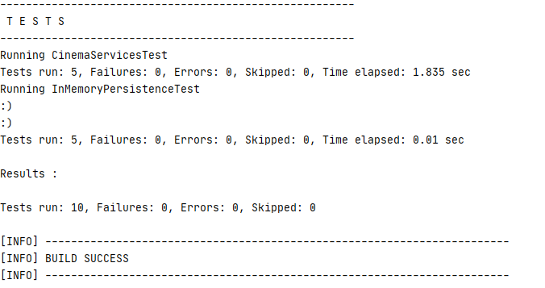

# Arquitecturas de Software
# Laboratorio 3 Introduction to Spring and Configuration using annotations

## Integrantes
- David Alejandro Vasquez Carreño
- Michael Jefferson Ballesteros Coca

____________
#### Instalación

Vamos a compilar el código con maven.
   ```console
mvn compile
   ```


Para ejecutar el programa.

  ```console
mvn exec:java -Dexec.mainClass="edu.eci.cinema.SpringCinema"
   ```

Para ejecutar las pruebas

  ```console
mvn test
   ```

Resultados:


____________


## Contribuciones

* **Alejandro Vasquez** - *Extender* - [alejovasquero](https://github.com/alejovasquero)
* **Michael Ballesteros** - *Extender* - [Wasawsky](https://github.com/Wasawsky)
